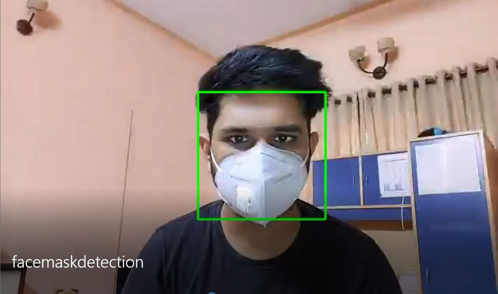

# facemaskdetection

This Project is to track people don't move outside without wearing a mask as it has been made mandatory due to covid19 spread, 
can be implemented in CCTV for helping authorities to control the spread of COVID19 NOTE: this is the simplest way to implement this, 
having only 10 lines of code with a decent accuracy :)
Youtube Link : 
https://www.youtube.com/watch?v=cCkuFLfTicY

